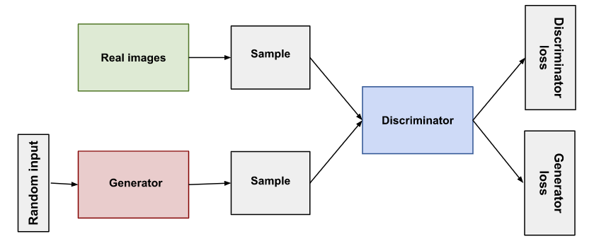
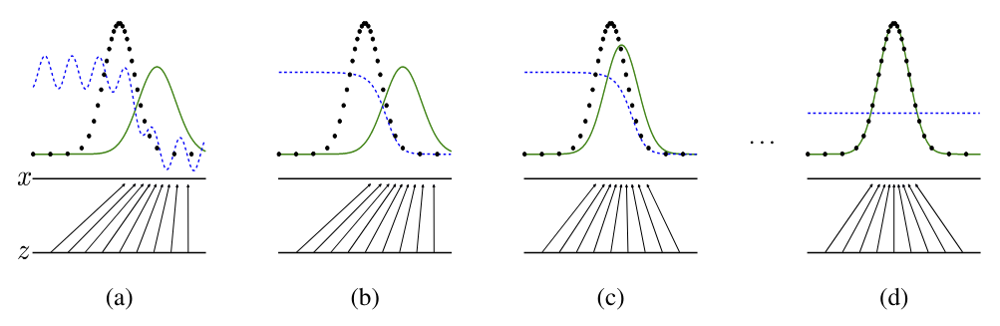
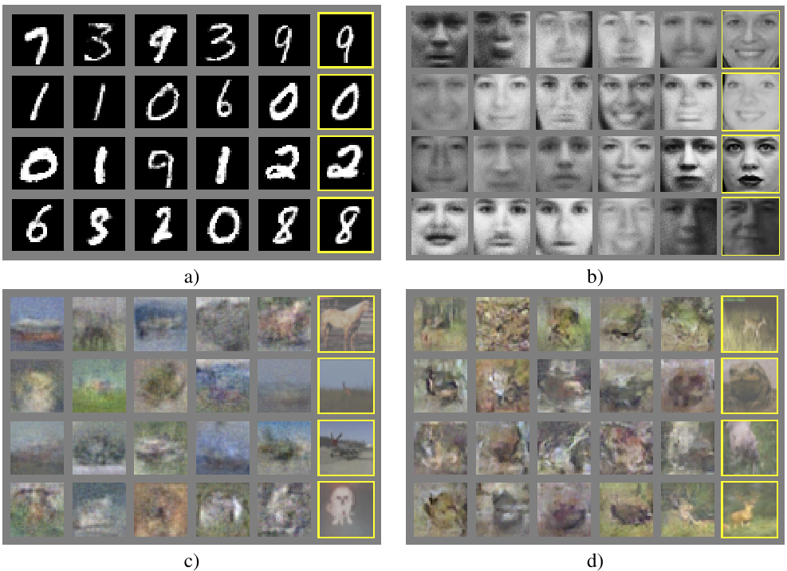

# Scientific paper

Goodfellow, I., Pouget-Abadie, J., Mirza, M., Xu, B., Warde-Farley, D., Ozair, S., ... & Bengio, Y.
(2014). Generative adversarial nets. Advances in neural information processing systems, 27.

# Architecture illustration

# Connection to other papers

# Interesting resources

- [Official github repository](https://github.com/goodfeli/adversarial) by Ian GoodFellow
