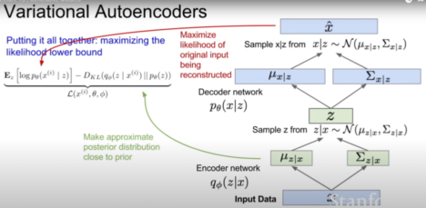

# Scientific paper

Kingma, D. P., & Welling, M. (2013). Auto-encoding variational bayes.
[arXiv preprint arXiv:1312.6114](https://arxiv.org/abs/1312.6114).

# Architecture illustration

taken from [YouTube](https://www.youtube.com/watch?v=5WoItGTWV54)

# Connection to other papers

# Interesting resources

- Lecture Collection. Convolutional Neural Networks for Visual Recognition (Spring 2017).
  Lecture 13 | Generative Models. Stanford University. [YouTube](https://www.youtube.com/watch?v=5WoItGTWV54)
- Variational Autoencoders. Arxiv Insights. [YouTube](https://www.youtube.com/watch?v=9zKuYvjFFS8)
