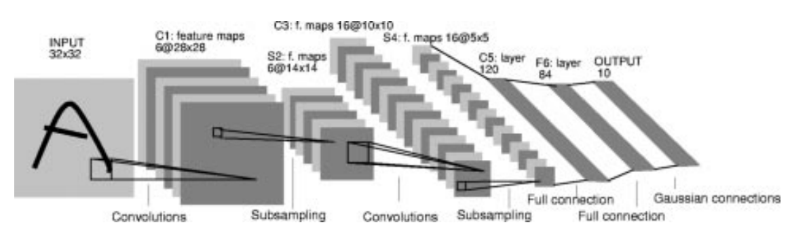
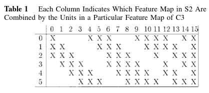

# Scientific paper

LeCun, Y., Bottou, L., Bengio, Y., & Haffner, P. (1998).
[Gradient-based learning applied to document recognition](https://hal.science/hal-03926082/document).
Proceedings of the IEEE, 86(11), 2278-2324.

# Architecture illustration

# Connection to other papers

# Interesting resources
