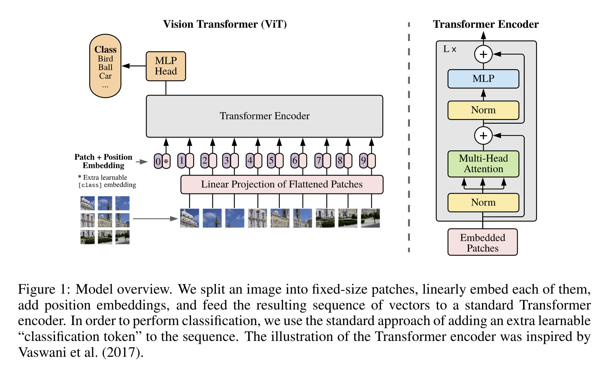
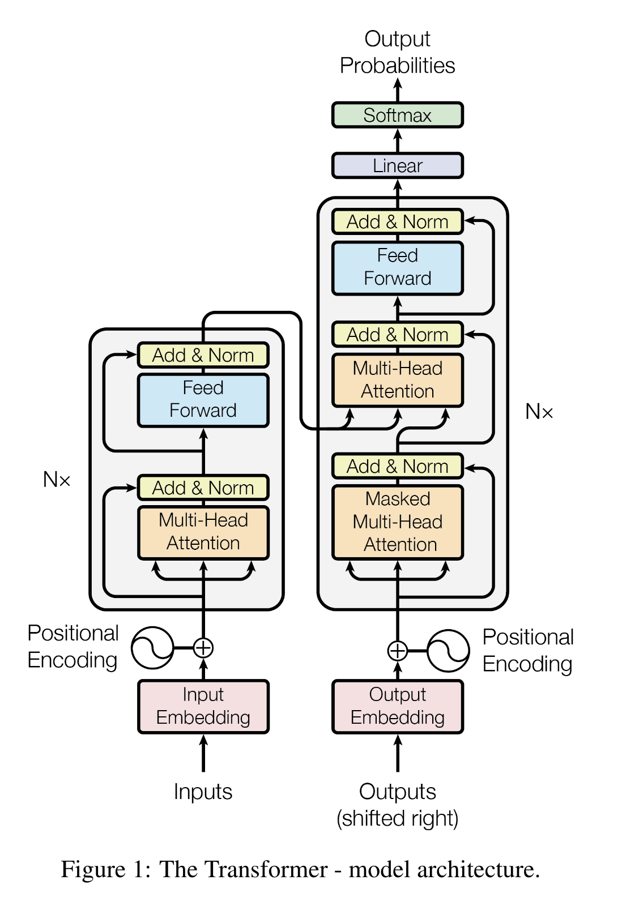
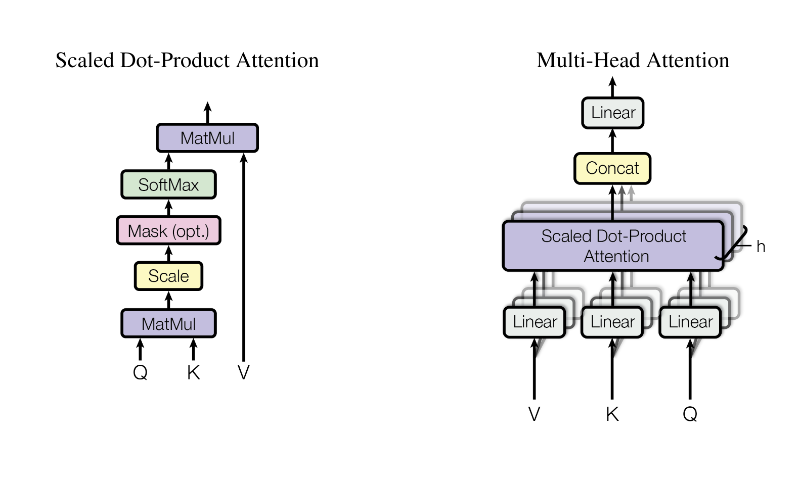

# Scientific paper

Dosovitskiy, A., Beyer, L., Kolesnikov, A., Weissenborn, D., Zhai, X., Unterthiner, T., ... & Houlsby, N. (2020).
An image is worth 16x16 words: Transformers for image recognition at scale.
[arXiv preprint arXiv:2010.11929](https://arxiv.org/abs/2010.11929).

# Architecture illustration

# Connection to other papers

Vaswani, A., Shazeer, N., Parmar, N., Uszkoreit, J., Jones, L., Gomez, A. N., ... & Polosukhin, I. (2017).
[Attention is all you need](https://arxiv.org/pdf/1706.03762.pdf). Advances in neural information processing systems, 30.

# Advantages and limitations

+ attend to different location even in first layers
- Attention mechanisms requires intensive computation. The dot product between all tokens
is a O(n²) operation.

# Interesting resources

- Yannic Kilcher's video explanation: https://www.youtube.com/watch?v=TrdevFK_am4
